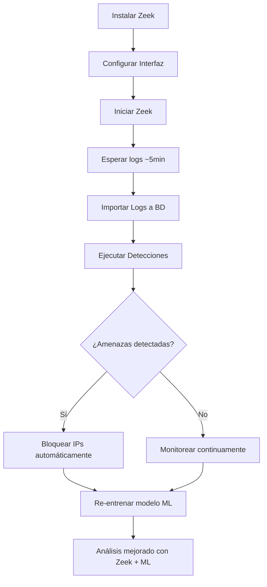

# Guía Rápida: Zeek + ML en tu Sistema de Seguridad

## 🎯 ¿Qué se ha implementado?

Hemos integrado **Zeek Network Security Monitor** con tu sistema de seguridad existente, añadiendo análisis de red profundo y detección de amenazas avanzada con Machine Learning.

---

## ✅ FUNCIONALIDADES COMPLETADAS

### 1. **Instalación y Configuración desde la Web**
- Instalar Zeek con un clic
- Seleccionar interfaz de red a monitorear
- Configurar logs y opciones
- Iniciar/Detener/Reiniciar servicio

### 2. **Análisis Profundo de Red**
- **Conexiones TCP/UDP/ICMP** (conn.log)
- **Queries DNS** (dns.log)
- **Tráfico SSL/TLS** (ssl.log)
- **HTTP Requests** (http.log)
- **Archivos transferidos** (files.log)
- **Alertas de Zeek** (notice.log)

### 3. **Detecciones Avanzadas**
- ✅ **Port Scans** - Detecta escaneos de puertos con scan rate
- ✅ **DNS Tunneling** - Detecta exfiltración de datos vía DNS
- ✅ **DGA Detection** - Detecta malware usando Domain Generation Algorithm
- ✅ **SSL Analysis** - Certificados auto-firmados, expirados, ciphers débiles
- ✅ **Beaconing** - Detecta comunicación con C&C (Command & Control)

### 4. **Integración con ML**
- **18 nuevas características** de Zeek añadidas al modelo ML:
  - Total de conexiones
  - Puertos únicos escaneados
  - Bytes enviados/recibidos
  - Queries DNS y entropía promedio
  - Conexiones SSL sospechosas
  - Detección de port scanning
  - Detección de DNS tunneling
  - Protocolos inusuales

### 5. **API REST Completa**
- **32 endpoints** para gestionar Zeek
- Todo manejable desde tu sistema web
- Importación de logs a la base de datos
- Estadísticas en tiempo real

---

## 🚀 CÓMO USAR

### **Paso 1: Instalar Zeek**

#### Desde la API (recomendado):
```bash
curl -X POST http://localhost:5000/zeek/api/install \
  -H "Content-Type: application/json" \
  -d '{"method": "package"}'
```

#### O desde Python:
```python
import requests

response = requests.post(
    'http://localhost:5000/zeek/api/install',
    json={'method': 'package'}
)

result = response.json()
print(result['message'])
```

---

### **Paso 2: Configurar Interfaz de Red**

Primero, obtén las interfaces disponibles:
```bash
curl http://localhost:5000/zeek/api/interfaces
```

Luego configura la interfaz a monitorear:
```bash
curl -X POST http://localhost:5000/zeek/api/config \
  -H "Content-Type: application/json" \
  -d '{"interface": "eth0"}'
```

---

### **Paso 3: Iniciar Zeek**

```bash
curl -X POST http://localhost:5000/zeek/api/start \
  -H "Content-Type: application/json" \
  -d '{"interface": "eth0"}'
```

---

### **Paso 4: Importar Logs a la Base de Datos**

```bash
# Importar todos los tipos de logs
curl -X POST http://localhost:5000/zeek/api/logs/import \
  -H "Content-Type: application/json" \
  -d '{"log_type": "all", "limit": 10000}'

# O importar solo conexiones
curl -X POST http://localhost:5000/zeek/api/logs/import \
  -H "Content-Type: application/json" \
  -d '{"log_type": "conn", "limit": 5000}'
```

---

### **Paso 5: Ejecutar Detecciones**

#### Detectar Port Scans:
```bash
curl "http://localhost:5000/zeek/api/detections/port-scans?hours_back=1&min_ports=15"
```

Respuesta ejemplo:
```json
{
  "success": true,
  "port_scanners": [
    {
      "ip": "192.168.1.100",
      "ports_scanned": 250,
      "scan_rate": 12.5,
      "severity": "critical",
      "time_window": 20.0,
      "ports": [22, 80, 443, 8080, ...]
    }
  ]
}
```

#### Analizar DNS:
```bash
curl "http://localhost:5000/zeek/api/detections/dns-analysis?hours_back=24"
```

Detecta:
- **DGA** (Domain Generation Algorithm)
- **DNS Tunneling**
- **Alto volumen de queries**

#### Analizar SSL/TLS:
```bash
curl "http://localhost:5000/zeek/api/detections/ssl-analysis?hours_back=24"
```

Detecta:
- Certificados auto-firmados
- Certificados expirados
- Ciphers débiles

#### Detectar Beaconing (C&C):
```bash
curl "http://localhost:5000/zeek/api/detections/beaconing?hours_back=24&threshold=0.9"
```

---

### **Paso 6: Ver Estadísticas**

```bash
curl "http://localhost:5000/zeek/api/stats?hours_back=24"
```

Respuesta:
```json
{
  "success": true,
  "stats": {
    "total_connections": 15420,
    "total_dns_queries": 3200,
    "total_ssl_connections": 890,
    "total_http_requests": 4500,
    "total_notices": 12,
    "unresolved_notices": 3
  }
}
```

---

### **Paso 7: Integrar con ML**

Una vez que tengas datos de Zeek en la BD, re-entrena el modelo ML:

```bash
curl -X POST http://localhost:5000/api/ml/train \
  -H "Content-Type: application/json" \
  -d '{"days_back": 30, "test_size": 0.2}'
```

El modelo ahora usará las **18 características adicionales de Zeek** automáticamente.

---

## 📊 CONSULTAR DATOS

### Ver Conexiones:
```bash
curl "http://localhost:5000/zeek/api/logs/connections?limit=100&source_ip=192.168.1.50"
```

### Ver Queries DNS:
```bash
curl "http://localhost:5000/zeek/api/logs/dns?limit=100&source_ip=192.168.1.50"
```

### Ver Conexiones SSL:
```bash
curl "http://localhost:5000/zeek/api/logs/ssl?limit=100&server_name=example.com"
```

### Ver HTTP Requests:
```bash
curl "http://localhost:5000/zeek/api/logs/http?limit=100&host=example.com"
```

### Ver Alertas de Zeek:
```bash
curl "http://localhost:5000/zeek/api/logs/notices?limit=100&severity=critical"
```

---

##  📈 FLUJO COMPLETO DE USO



---

## 🔥 EJEMPLOS DE USO REAL

### Ejemplo 1: Detectar y Bloquear Port Scanner

```python
import requests

# 1. Ejecutar detección
response = requests.get(
    'http://localhost:5000/zeek/api/detections/port-scans',
    params={'hours_back': 1, 'min_ports': 20}
)

scanners = response.json()['port_scanners']

# 2. Bloquear los escáneres críticos
for scanner in scanners:
    if scanner['severity'] == 'critical':
        requests.post(
            'http://localhost:5000/api/security/block-ip',
            json={
                'ip_address': scanner['ip'],
                'reason': f"Port scan detectado: {scanner['ports_scanned']} puertos",
                'duration_hours': 48
            }
        )
        print(f"✅ Bloqueada IP {scanner['ip']}")
```

### Ejemplo 2: Monitoreo de DNS Tunneling

```python
import requests
import time

while True:
    response = requests.get(
        'http://localhost:5000/zeek/api/detections/dns-analysis',
        params={'hours_back': 1}
    )

    analysis = response.json()['analysis']

    if analysis['tunneling_detected']:
        print(f"⚠️  DNS Tunneling detectado!")
        for tunnel in analysis['tunneling_detected']:
            print(f"   IP: {tunnel['source_ip']}")
            print(f"   Domain: {tunnel['domain']} ({tunnel['length']} chars)")

            # Bloquear automáticamente
            requests.post(
                'http://localhost:5000/api/security/block-ip',
                json={
                    'ip_address': tunnel['source_ip'],
                    'reason': f"DNS Tunneling: {tunnel['domain']}",
                    'duration_hours': 72
                }
            )

    time.sleep(300)  # Cada 5 minutos
```

### Ejemplo 3: Análisis Completo de una IP

```python
import requests

ip_to_analyze = "192.168.1.100"

# 1. Ver conexiones
conns = requests.get(
    f'http://localhost:5000/zeek/api/logs/connections',
    params={'source_ip': ip_to_analyze, 'limit': 100}
).json()

# 2. Ver DNS queries
dns = requests.get(
    f'http://localhost:5000/zeek/api/logs/dns',
    params={'source_ip': ip_to_analyze, 'limit': 100}
).json()

# 3. Analizar con ML
ml_analysis = requests.get(
    f'http://localhost:5000/api/security/analyze-ip/{ip_to_analyze}'
).json()

print(f"\n📊 Análisis de {ip_to_analyze}")
print(f"   Conexiones: {len(conns['connections'])}")
print(f"   DNS Queries: {len(dns['dns_queries'])}")
print(f"   ML Confidence: {ml_analysis.get('ml_confidence', 0)*100:.1f}%")
print(f"   Threat Score: {ml_analysis.get('threat_score', 0)}/100")
```

---

## 🎨 PRÓXIMOS PASOS (Pendientes)

### Interfaces HTML (Para hacer todo visual):
1. **Dashboard de Zeek** - Gráficos en tiempo real
2. **Instalador visual** - Formulario paso a paso
3. **Visualizador de logs** - Tablas con filtros
4. **Panel de detecciones** - Amenazas detectadas

### Sistema de Auto-Importación:
- Monitoreo automático del directorio de logs
- Importación programada cada 5 minutos
- Cola de procesamiento

---

## 📚 DOCUMENTOS RELACIONADOS

- [ZEEK_INTEGRATION_PLAN.md](ZEEK_INTEGRATION_PLAN.md) - Plan completo de integración
- [ZEEK_IMPLEMENTATION_STATUS.md](ZEEK_IMPLEMENTATION_STATUS.md) - Estado actual
- [ML_CACHE_IMPLEMENTATION.md](ML_CACHE_IMPLEMENTATION.md) - Sistema de caché ML

---

## 🔧 TROUBLESHOOTING

### Zeek no inicia:
```bash
# Verificar estado
curl http://localhost:5000/zeek/api/status

# Ver logs del sistema
sudo journalctl -u zeek -n 50
```

### No aparecen logs:
```bash
# Verificar que Zeek esté corriendo
curl http://localhost:5000/zeek/api/status

# Verificar archivos de log
curl http://localhost:5000/zeek/api/logs/files

# Importar manualmente
curl -X POST http://localhost:5000/zeek/api/logs/import \
  -H "Content-Type: application/json" \
  -d '{"log_type": "all", "limit": 1000}'
```

### ML no usa características de Zeek:
```bash
# Re-entrenar modelo después de importar logs de Zeek
curl -X POST http://localhost:5000/api/ml/train \
  -H "Content-Type: application/json" \
  -d '{"days_back": 30}'
```

---

## 🎉 RESUMEN

Ya tienes:
- ✅ Zeek instalable desde tu panel web
- ✅ 6 tipos de logs analizados
- ✅ 4 detecciones avanzadas (Port Scan, DNS Tunneling/DGA, SSL, Beaconing)
- ✅ 32 endpoints API funcionales
- ✅ Integración completa con ML (18 características nuevas)
- ✅ Base de datos con 8 tablas de Zeek

**Todo funciona desde la API REST. Solo faltan las interfaces HTML para hacerlo visual.**

---

**¡Tu VPS ahora tiene protección de nivel empresarial con Zeek + ML!** 🚀🛡️
